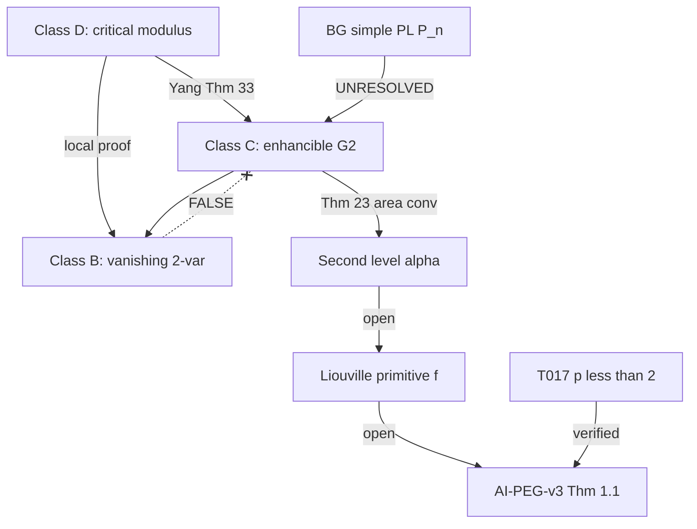

# Area Enhancement Dependency Graph

```mermaid
flowchart TD
    D[Class D: critical modulus] -->|Yang Thm 33| C[Class C: enhancible G2]
    D -->|local proof| B[Class B: vanishing 2-var]
    C --> B
    B -.-x|FALSE| C
    BG[BG simple PL P_n] -->|UNRESOLVED| C
    C -->|Thm 23 area conv| A2[Second level alpha]
    A2 -->|open| L[Liouville primitive f]
    L -->|open| AI[AI-PEG-v3 Thm 1.1]
    T17[T017 p less than 2] -->|verified| AI
```

**Frozen:** T017 chain does not use this graph.
